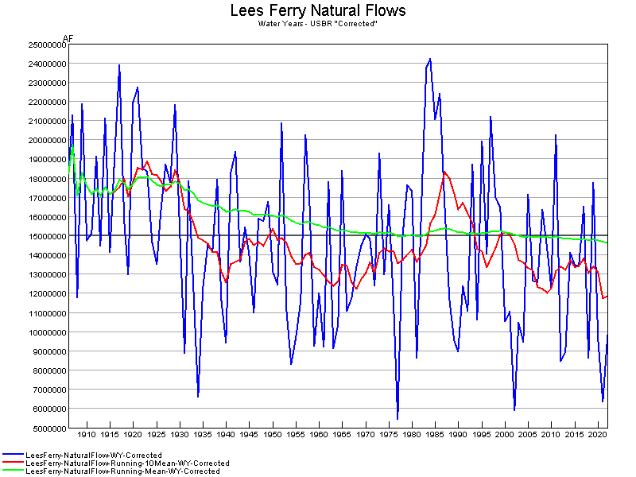

# NaturalFlows/LeesFerry #

This example downloads an Excel workbook with Natural Flows from the US Bureau of Reclamation
and creates a graph showing the annual flows, 10-year running average,
and average considering all years inclusive of each historical year.

The file location may change in the future so check the following
[Reclamation web page](https://www.usbr.gov/lc/region/g4000/NaturalFlow/provisional.html).

The output is as follows:

