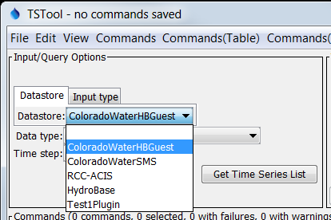
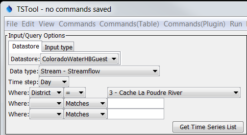
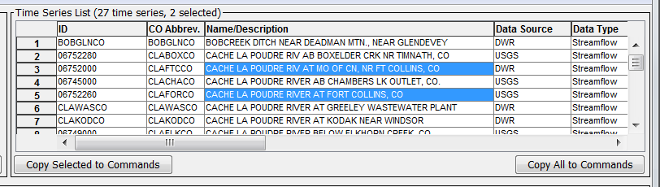

# Learn TSTool / Lesson / Read HydroBase Web Service #

This lesson explains how to use the TSTool software to access State of Colorado HydroBase data via web services.

**Expected completion time:  15 minutes**

----

## Lesson Goal ##

The goal for this lesson is to create a TSTool command file to automate download of time series from
the State of Colorado's HydroBase web services.

## Background ##

The State of Colorado's HydroBase is the core database for much of the water-related data managed by the Division of Water Resources (DWR),
which has statutory requirements to administer water use in Colorado according to Colorado water laws.
DWR has created web services that allow software such as TSTool to query HydroBase (see:
[Web Services documentation](http://water.state.co.us/DataMaps/WebServices/Pages/WebServices.aspx)).
The current web services require custom software to access the data but DWR is working on a new generation of web services
that simplifies access, including web browser access (may be available in some form in late 2017).

TSTool facilitates using web services by providing query options and features to save the retrieved data.
This is accomplished by using time series identifiers for the web service datastores.
See the upper left ***Datastore*** choice in the TSTool main window.
Selecting the ***ColoradoWaterHBGuest*** web service provides access to historical data (typically day, month, and year interval) whereas
selecting the ***ColoradoWaterSMS*** web service provides access to real-time data (typically 15min, hour, and day interval).

Once a datastore is selected other choices will be made available to select time series by data type,
interval, and also filter by other data attributes.

## Example - Read Daily Streamflow ##

This example illustrates how to query historical daily streamflow data and save to a file.
First use TSTool query some time series of interest:

1. Select the datastore and query parameters as shown in the above image.
2. Press ***Get Time Series List*** to query the time series list.
3. Right-click on the ***Name/Description*** column and sort the data in ascending order so that it is easier to pick stations of interest.
4. Use `CTRL-click` to select the time series of interest (such as shown in the following image).
5. Press ***Copy Selected to Commands***.

The above steps will create time series identifier commands in the ***Commands*** area.
Press ***Run All Commands*** to read the data from HydroBase web services.
Then right-click on the ***Time Series*** list in the bottom ***Results*** area and graph, for example as a line.
This confirms that the data were read.

Next, add a command to write the time series to a comma-separated-value (CSV) file:

1. Save the command file to a file so that remaining commands can use relative paths, using ***File / Save / Command File***.
For example save to a file `example-read-streamflow.TSTool`.
2. Select the menu ***Commands / Output Time Series / WriteDelimitedFile()***
Specify an output file of `streamflow.csv`.  All other parameters can be left as default.
3. Run the commands with ***Run All Commands***.  The results will now also list the output file, which can be used in analysis.

## Files ##

The files for this lesson are available in the GitHub repository:

* [`example-read-streamflow.TSTool`]()

## Next Steps ##

Next steps might include:

* Use additional commands for analysis.
* Write the time series to Excel.
* Automate graphs.
